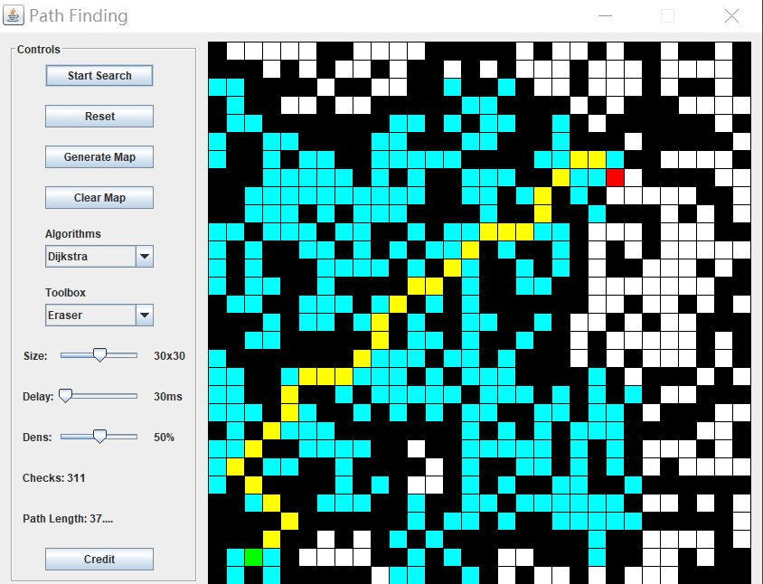
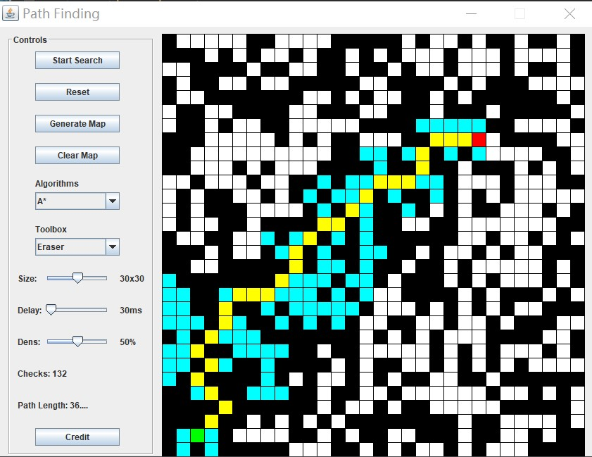
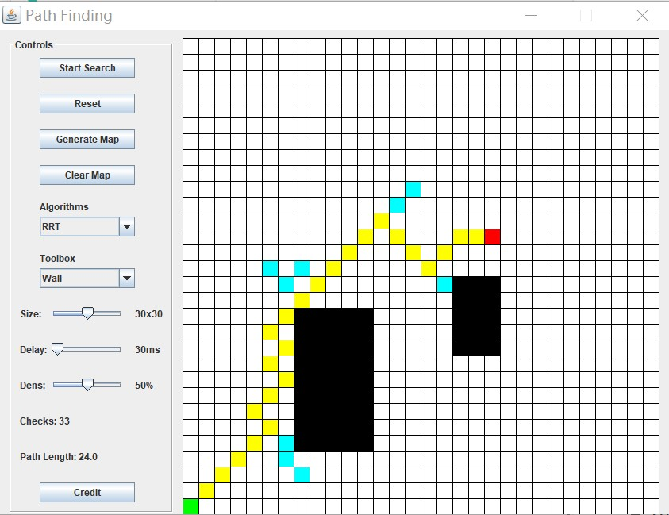

# SpringBoot Demo & Path Planning Algorithm Demo
## SpringBoot Demo
* ORM: Mybatis-plus
* SQL: MySql(multi-sources), Druid
* NoSQL: Redis, MongoDB (has bug)
* Cache: Ehcache 2.x, Redis
* Auth: Spring Security
* AOP: spring-boot-starter-aop
* Lombok: lombok
* JSON: fastjson
* WebSocket: TODO...

## Path Planning Algorithm Demo
###1.Dijkstra

###2.A*

###3.RRT

